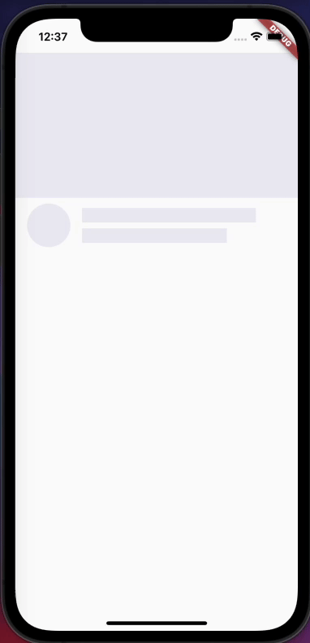

# shimmer_sample

This is a sample of Shimmer Effect!



## Getting Started

```sh
# 1. move directory
cd /path/to/shimmer_sample

# 2. get dependencies
flutter pub get

# 3. run app
flutter run
```

## What is "Shimmer"?
"Shimmer" is effect of chrome color with shimmer.

see more detail
https://flutter.dev/docs/cookbook/effects/shimmer-loading

## How to implemnt Shimmer?
The implemtentations procedure is as follows

1. create skeleton of UI.
2. add gradient effect.
3. add animation.

see more detail
- [my blog](http://)
- [flutter cookbook](https://flutter.dev/docs/cookbook/effects/shimmer-loading)